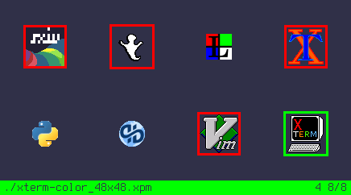

# sxiv
My build of sxiv

_The "My build" is only for keybindings. This is meant to be as standard as possible_


# Instalation
```
sudo make install clean
```

_NOTE:_ If you are comming from a minimal set up, the only packages that you need, and you haven't installed sxiv before (not binary) you may need these (since I installed VoidLinux I searched the packages) :
```
xbps-install imlib2-devel libexif-devel giflib-devel
```

# Features

* You can navigate with j/k and scroll with h/j/k/l (when zoomed in, you can scroll; or else navigate to the next/prev image)
* Square-shaped "marks" and highlighted images in "thumbnail mode".
* Syncs with pywal by default
* More thumbnail adjustment on config.h
* With Q you quit sxiv and output the name of the image that was selected
* Navigate to random image
* Scale to fill the window
* Stream images directly from the web (example: `sxiv 'https://raw.githubusercontent.com/explosion-mental/sxiv/main/sxiv.png'` )

## Key Handler
With the patch I made (someone who knows diff and all that please make it correct), there's no need for "prefix-key" to execute a command on keyhandler, pretty stuff!
Although there are **two** options:
1. With the default one, on `main.c`, you will **only** be able to execute something on the keyhandler if that key isn't bound on config.h (i.e., config.h dominates).
2. The other option is to have them _simultaneously_, if the key that you pressed is on config.h try to execute the command that is on command.c (i.e., the normal sxiv commands) or else search it on the keyhandler (that's why on every other key it will always be searching for it, as you can see on the bar when pressing keys that aren't on the keyhandler, sometimes it executes faster so it seems like it doesn't show up).
  - With this kind of handling the handler you can do pretty stuff like bind SCALE_FIT to "w" and, on the key-handler, bound also "w" to [setbg](https://github.com/explosion-mental/scripts/blob/main/setbg). The result would be, if SCALE_FIT can be executed then run it else search on key-handler, basically if the image is zoomed in/out or in other SCALE mode (if it can be SCALEd to FIT) do it, but if it's already "fit" then set the img as a wallpaper (setbg script).

(I personally prefer the first way, because even I don't use the bar, the text saying _Keyhandler..._ annoys me and makes me think its searching on the keyhandler when it's not needed.)

## [Count]
- A vim inspired way of multiplying the keystrokes of movement & modification.
- Example: Pressing `10` and 'G' (which is for the "nth" image or defaults to the last image in absence of `n`) takes you to the 10th image.
- Say you type `5` & `}`, this would add '+5' to the Gamma and so on.
  - Of couse not all commands have that but some of them do. I don't really use this 'feature'. I noticed it's a bit slow (or maybe it's probably just me)
  - You can toggle it on/off by uncommentting/commenting it in config.mk. I don't know any other way to do this, hopefully it's not a terrible thing. You also need to change the number keys in the key-handler (by default in `~/config/sxiv/exec/key-handler) to letters (or whatever you want), to make remove conflicts.

## Patches
Just look them up [here](https://github.com/explosion-mental/sxiv/tree/main/patches), most of them aren't on this build.

# Fork
_Escape key can be mapped in config.h., it is now `Sxiv - [Directory's basename]`..._ go to [qsmodo fork](https://github.com/qsmodo/sxiv/commits/master) for more.

# Help...
This is really the best image viewer and probably the fastest! After my changes it's even better for me. I have one issue:
- What's the best position/intuitive (preferably not with Shift) for some actions on sxiv?

# TODO
- Load all frames from TIFF files. We have to write our own loader for this to
  happen--just like we did for GIF images--because Imlib2 does not support
  multiple frames. Issue #241.
- Add support for more embedded thumbnail formats. Right now, sxiv seems to use
  the smallest one. Issue #238.

# My Build Todos
- Autoreload feature? (It needs to reload images when invoke keyhandler? the markcnt doesn't update after moving files to other directory with a keyhandler command)
- Better use of space
- '-T' for title
- <s>'-d' for dmenu like output?</s> Why have a flag, a command added called dmenu_output added ☑️
- If the bar is hidden in image mode, toggle the bar while switching modes (maybe bar is always shown in "thumbnail mode"? 	cg_toggle_bar();)
- <s>After adding the padding patch, I found a screenshot of my dwm bar which is really wide but not with much height. When I marked it in "thumbnail mode" on some of the smalls zooms the image dissapears (the image was almost as thick as the marks)</s>
- Is there a way to scroll & not navigate in WIDTH mode? (usefull on some memes, and comics)
- <s>How to loop on the command 'cg_navigate_marked'? (on marked images)</s> Done✅
- <s>Actual support for clipboard, I use xsel just because clipmenu use it (I don't want to fork it now but some time I will in order to work with xclip)</s> I use xclip now✅
- Is there a way to toggle square thumbnails? (I don't think I need/want this, just asking)
- <s>version.h seems useless?</s> It was(?)✔️
- When searching recursively (i.e., search all images in the directory and subdirs), images names on the bar are displayed. I would like to know in which directory am I (dirname), so how to show the subdirectory of the directory in which sxiv was called to be recursive.
- <s>Make "if" statement (either '#if' or 'if') on a value or definition on the config.mk in order to make `count` (that is: when pressing a number (like '10'), sxiv's default behaviour would be to wait for the next command. Let's say, again, after those two keys you press G (which is bounded to the command 'n_or_last') that means you would go '10' images "down". I don't really use this but I supposed that there are people who find this usefull, so I'm thinking a way to make that optional (user decides).</s> Done✅. You decide if you want that or not (which i believe is just there for some reason) See the `[Count]`
- How to make '#ifdef' on tns_move_selection. That is, how to remove the 'cnt' var?
- Remove all position modificacion (zoom, rotation) RESTORE to default?, so reload image
- <s>Is there a way to maximaze space in "thumbnail mode"?</s> Done☑️ Use **Square thumbnails**

# Major improvements:
- More responsive after WM_HINTS patch
- Compile even if sxiv is active _(cp -f)_
- version.h not needed (one less file)
- Not an improvement but for my standards of understading: I make a config.mk _just like st, dwm and dmenu_ so you can configure it I guess, also the autoreload_inotify/nop was annoying so I combine them into **one** file, if you want the autoreload before it, add it on the Makefile. Because of this 'suckless' style, the compile messages are alike (I'm debating this, the initial messages where really clean and I like them, suggest something maybe?)
- Saner config.h (Mar 24)
- On/off Prefix-keys on *some* commands(Mar 25)
- Streaming url images (May 25)
