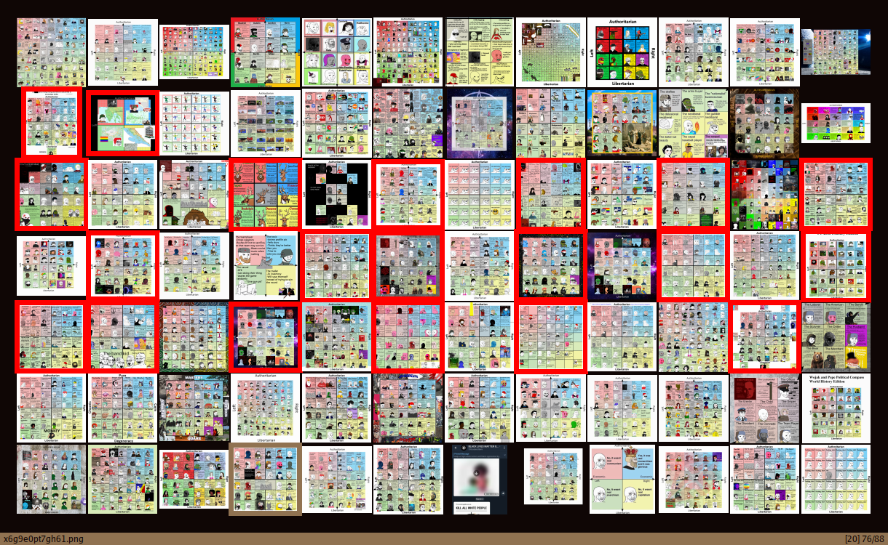

# sxiv
My build of sxiv

# Features

## Key Handler
With the patch I made (someone who knows diff and all that please make it correct), there's no need for "prefix-key" to execute a command on keyhandler, pretty stuff!
There are **two** options tho:
- With the default one, on main.c, you will **only** be able to execute something on the keyhandler if that key isn't bound on config.h (config.h predominates).
- The other option is have them _simultaneous_ (I don't know how to call it or explain it), if that key that you press is on config.h try to execute the command that is on command.c (basically normal sxiv commands) else search it on the keyhandler (that's why on whatever key it will be always searching for it, you can see it on the bar when pressing keys that aren't on the keyhandler, sometimes it executes faster so it seems like it doesn't show up). With this kind of handling the handler you can do pretty stuff like bind SCALE_FIT to "w" and, on the key-handler, bound also "w" to [setbg](https://github.com/explosion-mental/scripts/blob/main/setbg). The result would be, if SCALE_FIT can be executed then run it else search on key-handler, basically if the image is zoomed in/out or in other SCALE mode (if it can be SCALEd to FIT) do it, but if it's already "fit" then set the img as a wallpaper (setbg script).

I'm trying the first option because, even I don't use the bar, the text saying _Keyhandler..._ annoys me and makes me think its searching on the keyhandler when it's not needed.

## Patches
Just look them up, most of them aren't on this build.

# Fork
I use someone's fork which I don't remember why I did it, but his fork I believe is on sxiv.1
_Note:_ after looking for all the forks I could find, the [qsmodo fork](https://github.com/qsmodo/sxiv/commits/master) was really logic in the code that has been changed. Of course I would like more things that's why this exist, so thanks to that repo.

# Help...
This is really the best image viewer and prob the fastest! After my changes it's even better for me. I have one issue
- What's the best position/intuitive (preferably not with Shift, my pinky hurts) for some actions on sxiv?
- Also, is there a way to maximaze space on thumbnail mode?(Maybe with square thumbnails dummy?)
- See *[TODO](TODO.md)* if you wanna help

# TODO (why have a separate file)
- Load all frames from TIFF files. We have to write our own loader for this to
  happen--just like we did for GIF images--because Imlib2 does not support
  multiple frames. Issue #241.
- Add support for more embedded thumbnail formats. Right now, sxiv seems to use
  the smallest one. Issue #238.

## My Build Todos

- Autoreload feature  ( It needs to reload images when invoke keyhandler? the markcnt doesn't update after moving files to other directory with a keyhandler command )
- Use the space better
- '-T' for title and '-d' for dmenu like output?
- If the bar is hidden when image mode, when switching modes toggle the bar (maybe bar always shown on thumbnail mode? 	cg_toggle_bar();)
- after the padding patch I notice , I had an screenshot of my dwm bar it is really wide but not with that much height. When I mark it on thumbnail mode on some of the smalls zooms the image "dissapear" (the image was almost as thick as the marks)
- Is there a way to not navigate (to scroll) on WIDTH mode? (usefull on some memes, an comics)
- <s>How to loop on the command 'cg_navigate_marked' ? (on marked images)<s>Done✅
- <s>Actual support for clipboard, I use xsel just because clipmenu use it (I don't want to fork it now but some time I will in order to work with xclip)</s> I use xclip now 😁✅
- Is there a way to toggle square thumbnails?(I don't think I need/want this, just asking)
- version.h seems useless?

## Mayor improvements:
- It feels more responsive after WM_HINTS patch
- version.h not needed (one file less) _**Note**_: I have no idea what that file was doing, looking at the **Makefile** says something about .git/index or whatever, I have no idea if that broke something external (not the program), maybe it was a little sync with the github main repo?
- Compile even if sxiv is active _(cp -f)_
- Not an improment but for my standards on understadings this: I make a config.mk _just like st and dwm_ so you can configure it I guess, also the autoreload_inotify/nop was annoying so I just change it to _inotify/nop_ if you want the autoreload before it add it on the Makefile.
